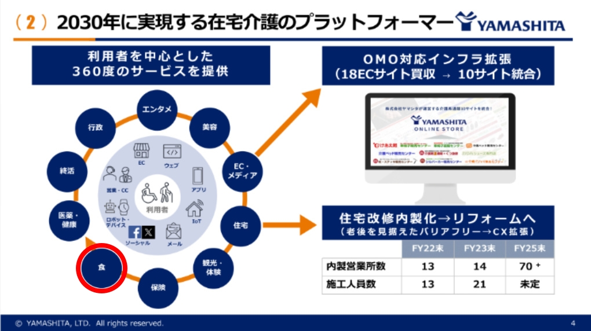

# 相談したいこと

ヤマシタ社が展開する以下の事業に対して、弊社保有の特許技術「instaCook」が高い親和性を持つと考えており、 **利用していただける提案が可能か。** を相談したいです。

1. リネンサプライ事業（業態ネットワークを活かした食領域への水平展開）
1. 住宅介護・在宅支援事業（高齢者向け施設の人手不足を解消した食事提供）   
※住宅介護・在宅支援事業は高齢者向け施設向けの事業ではありませんが関連性は高いと考えております。

これらを活かし、「食」×「ケア」×「自動化」という新規事業の創出をご一緒できないか、ご相談させていただきたいと考えております。   

#### **今後の事業内容に「食」が含まれることなど** を踏まえて。

https://www.fastgrow.jp/articles/fgc2024-takashima-yamashita   
※ここではoisixなどの連携と予想。

# 特許の内容
[行列解消型 即時提供システム](https://www.j-platpat.inpit.go.jp/c1801/PU/JP-7495768/15/ja)

#### 特許概要（要点）
- 内容：利用者が行列を待ち合わせしている間に、厨房で調理を完成させられるシステム
- 特徴：QRと写真付きラミネートを行列スペースに設置されたモニタに置くだけで会計前注文が可能
- 名称：飲食店システム、飲食物提供方法及び飲食店用プログラム (特許第7495768号）
- 商標：[instaCook](https://www.j-platpat.inpit.go.jp/c1801/TR/JP-2023-113413/40/ja) | [ロゴ](https://www.j-platpat.inpit.go.jp/c1801/TR/JP-2023-113414/40/ja)

#### [特許解説資料](https://docs.google.com/presentation/d/10Ab8g-QCLMxRszhTiJYQ3fNbdF0yzpfhhurFtJROI_Y/edit#slide=id.p)

---
### システムのセールスポイント

#### ユーザビリティとアクセシビリティ
- クレジットカードサイズの写真付きQRコードのみで操作完結
- タッチ操作や画面遷移を極力排除した **“UIレスUX”**
- 高齢者や外国人観光客でも迷わず利用可能
- 直感的・視覚的認識に特化

#### 多言語対応ラミネートでインバウンド対応
- 言語識別QRコード を用意することでカード一枚差し替えるだけでリアルタイム翻訳が可能
- 言語カードがない場合はデフォルトで日本語
- 翻訳済みメニューや注意点を事前に表示

#### アレルギー・カロリー・価格情報の即時提示
- モニター上に栄養情報／成分情報／価格を表示
- 施設や学食、社食との親和性が高い
- アレルゲンの排除や栄養管理にも対応可能

#### 店舗オペレーションの省力化
- 厨房以外の人員が不要
- 厨房側も同じく効率を最適化済み
- セルフレジが可能
- ラミネートと在庫連携による欠品防止。ラミネートがなくなれば 自動的に欠品と判断

### カメラとモニター、写真付きQRの利用で他に考えられる事業展開
1. 介護施設。入居カード(本人識別)のQRを読み込ませることで、アレルギーや食事傾向の統計から足りない栄養素などのアドバイスをモニターに表示できる。（学食・社食も可）
1. [フルオーダー可能なラーメン店。](https://docs.google.com/presentation/d/1tLgsUHslzx_7oIiSlzuEDa1eApOc2govbeSzxwc5jTE/edit#slide=id.p)スープ・麺・具材などを自分で選んで好みのラーメンを作成できる。(麺なし(=スープストック)、ビーガンラーメンなども可能)
1. ミスタードーナツ。各ドーナツ上にQRコードが印刷された紙(半透明)を置くことで、同じように金額などの情報が簡単にわかる。また紙は衛生上の観点からも有効

### 想定されるヤマシタ社との展開例（相性が良い理由）
1. **高齢者施設 × instaCook**
- 既存の介護インフラにセルフ給食機能を追加
- 栄養管理・誤配防止・食の自己決定を支援

2. **リネンサプライ先とのB2B展開**
- 病院・ホテル・社員食堂向けに簡易食事端末をOEMで展開可能
- QRベースの非接触・在庫管理・会計連携による業務効率化

3. **飲食業態へのネットワーク展開**
- ヤマシタ社のネットワーク先（食品卸・店舗運営企業など）へ横展開

### 新規事業が展開可能の場合
instaCookのシステムは作成済みで、PoCは＋＠の工数で可能

# 他の飲食店のアイデア 

### swifood「有人簡易対応＋セルフ体験型」
店舗出店済み   

[解説資料](https://docs.google.com/presentation/d/168KVlSb-aO1OQ33S8YaAY1dvAV9Yx5GsY6PWzRJFlFw/edit#slide=id.p)

[google map](https://www.google.co.jp/maps/place/swifood+%E6%97%A5%E7%AB%8B%E5%B9%B8%E7%94%BA%E5%BA%97/@36.5914556,140.6559685,17z/data=!3m1!4b1!4m6!3m5!1s0x60218146ae029c75:0xdac368d330bd4a7f!8m2!3d36.5914556!4d140.6585434!16s%2Fg%2F11wthsg00l?hl=ja&entry=ttu&g_ep=EgoyMDI1MDQwOS4wIKXMDSoJLDEwMjExNDUzSAFQAw%3D%3D)

